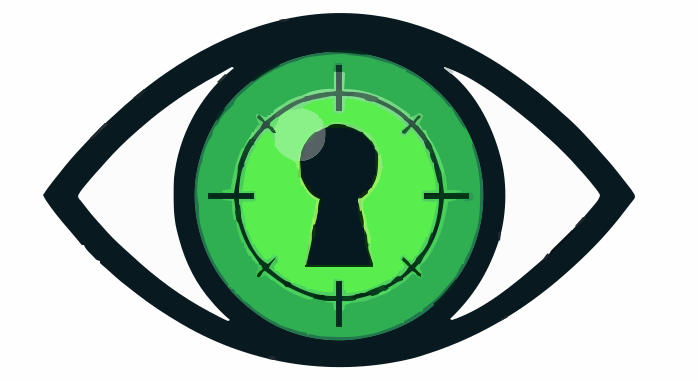

#  Catseye

**Static security analysis for Crystal web applications.**

Catseye finds vulnerabilities like SSRF and command injection by combining AST-based extraction with pattern-matching rules. It uses a multi-language architecture where each component plays to its strengths.

## Architecture

```
Nim (CLI)  →  Crystal (Extractor)  →  Gleam/BEAM (Logic Engine)
```

| Component | Language | Role |
|-----------|----------|------|
| **CLI** | Nim | File discovery, subprocess orchestration, colored output |
| **Extractor** | Crystal | Parses `.cr` files via `Crystal::Parser`, emits Security Node JSON |
| **Engine** | Gleam/Erlang | Decodes JSON, runs taint analysis + vulnerability rules |

## Quick Start

```bash
# Enter dev shell (requires nix)
nix develop

# Build and run all tests
just test

# Scan a directory
just scan path/to/crystal/code

# Build the CLI binary
just build
```

## Usage

```
catseye [options] <directory>

Options:
  --extractor <path>   Path to Crystal extractor (default: src/extractor/extractor.cr)
  --engine <path>      Path to Gleam engine dir (default: src/engine)
  --no-color           Disable colored output
  -h, --help           Show help
```

## Example Output

```
╔══════════════════════════════════════╗
║            Catseye v0.1.0            ║
╚══════════════════════════════════════╝
  Target:   src/app/
  Files:    12 Crystal source(s)
  Engine:   Gleam/BEAM

→ Extracting: src/app/client.cr
→ Running analysis engine (84 nodes)...

[SSRF] High  src/app/client.cr:42
  Potential SSRF: HTTP::Client.get called with variable argument(s): url.
  The URL may be user-controlled. Ensure URL validation and allowlisting is applied.

[CommandInjection] Critical  src/app/runner.cr:17
  Potential command injection via system. User input may flow into a shell command.

─────────────────────────────────────────
Found 2 issue(s) across 12 file(s).
```

## How It Works

### 1. Crystal Extractor (`src/extractor/`)

Parses Crystal source files using the compiler's own `Crystal::Parser` and `Crystal::Visitor`. Extracts:
- **Method calls** (`Call`) — tracks fully-qualified names like `HTTP::Client.get`
- **Assignments** (`Assign`) — propagates taint from sources to variables
- **Method definitions** (`Def`) — records function boundaries

Each node is emitted as a [Security Node](spec/security-node.schema.json) JSON object with type, name, args, line, and a taint flag.

### 2. Gleam Logic Engine (`src/engine/`)

Consumes the JSON and runs recursive pattern-matching rules on BEAM:
- **SSRF detection** — flags `HTTP::Client.*` calls with variable/tainted arguments
- **Command injection** — flags `system`/`exec`/`Process.run` with user-controlled input
- **Taint tracking** — variables assigned from `params`, `gets`, `request`, etc. are tracked

Rules share a single taint analysis pass (DRY) and are easy to extend.

### 3. Nim CLI (`src/cli/`)

Orchestrates the pipeline: discovers `.cr` files, runs the extractor on each, sends aggregated JSON to the engine via `erl -noshell`, and formats findings with colored terminal output.

## Development

```bash
nix develop           # Enter dev shell
just build            # Build all components
just unit-test        # Run Gleam unit tests (10 tests)
just test             # Full pipeline test
just extract foo.cr   # Run extractor on a single file
just clean            # Remove all build artifacts
```

### Adding a New Rule

1. Add the rule function in `src/engine/src/catseye/ssrf.gleam` (or create a new module)
2. Follow the existing pattern: filter by call name → filter by taint → map to `Finding`
3. Add the rule to `run_all_rules`
4. Add test cases in `src/engine/src/catseye/test_runner.gleam`
5. Run `just unit-test` to verify

## Project Structure

```
catseye/
├── spec/
│   └── security-node.schema.json   # JSON bridge schema
├── src/
│   ├── cli/catseye.nim             # Nim orchestrator
│   ├── extractor/extractor.cr      # Crystal AST extractor
│   └── engine/
│       ├── gleam.toml
│       └── src/
│           ├── catseye.gleam             # Engine entry point
│           ├── catseye/node.gleam        # Node types + helpers
│           ├── catseye/ssrf.gleam        # Security rules
│           ├── catseye/test_runner.gleam # Unit tests
│           └── catseye_engine_ffi.erl    # Erlang FFI (JSON + stdin)
├── test/samples/                    # Vulnerable + safe .cr files
├── flake.nix                        # Nix dev shell
└── justfile                         # Task runner
```

## License

MIT
